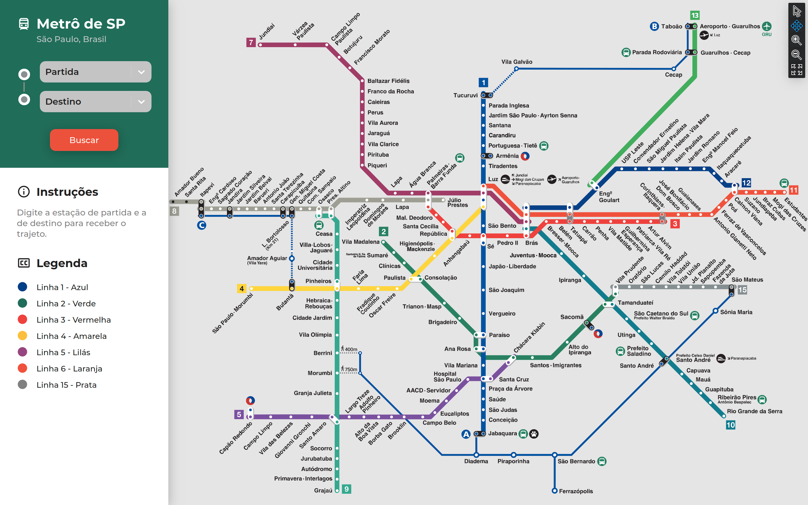
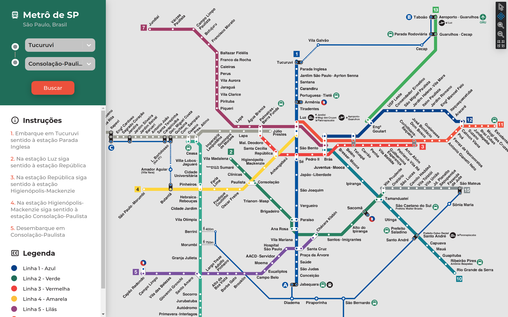

# Metro SP

**Número da Lista**: 1<br>
**Conteúdo da Disciplina**: Grafos 1<br>

## Alunos
|Matrícula | Aluno |
| -- | -- |
| 18/0114689  |  Tiago Samuel Rodrigues |
| 18/0113666  |  Ítalo Álves Guimarães |

## Sobre 
Este projeto tem como objetivo mostrar um guia de viagem pelas estações de metrô de São Paulo. O projeto utiliza dos algoritmos aprendidos na disciplina e do Algoritmo de Dijkstra para achar o menor caminho possível.

## Screenshots



## Instalação 
**Linguagem**: Javascript<br>
**Framework**: React.js<br>
Descreva os pré-requisitos para rodar o seu projeto e os comandos necessários.
Possuir o npm instalado na máquina

## Uso
clone o repositório

entre na pasta do repositório

rode
```
  npm install
  npm start
```
Navegue até [localhost:3000](http://localhost:3000)

## Outros 
Algumas estações mostradas no mapa podem não estar disponíveis para busca.
